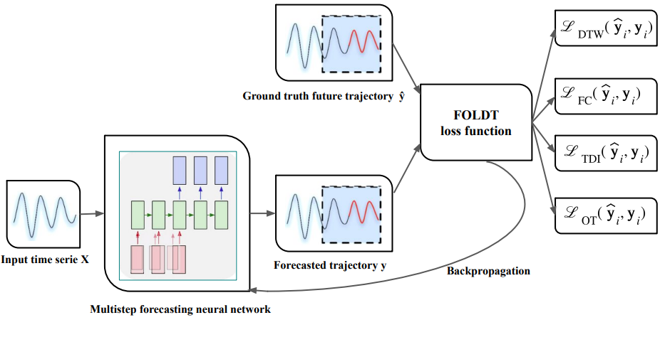

# Fourier-Optimal Loss for Distortion and Time in Non-Stationary Time Series Forecasting

This repository provides the implementation and experimental evaluation of
DILATE, FOLDT, PS, TRE, and Soft-DTW losses for time series forecasting.

## Abstract

Loss functions are critical to time series forecasting, where challenges such as non-stationarity, temporal misalignment, and structural variability persist. Existing regression and time-series-specific losses, including DILATE, TRE, and Soft-DTW, struggle to jointly capture shape fidelity, timing accuracy, and frequency coherence. To address these limitations, we propose FOLDT (Fourier-Optimal Loss for Distortion and Time), a novel loss function for univariate time series forecasting, which explicitly prioritizes shape preservation by aligning local and global structural patterns, enabling more accurate reconstruction of complex temporal dynamics.

## Acknowledgements

This work builds upon existing open-source implementations of time-series–specific loss functions. We sincerely thank the authors of the following repositories for their valuable contributions:

- **DILATE Loss**  
  Vincent Le Guen and Nicolas Thome  
  https://github.com/vincent-leguen/DILATE

- **PS Loss**  
  Dilfiraa et al.  
  https://github.com/Dilfiraa/PS_Loss

- **TRE Loss**  
  Liao Haibing et al.  
  https://github.com/liaohaibing/Trend-learning-loss-function

- **Soft-DTW Loss**  
  Marco Cuturi and Mathieu Blondel  
  https://github.com/mblondel/soft-dtw

These implementations were used for comparison, benchmarking, and inspiration in the development of the FOLDT loss.
